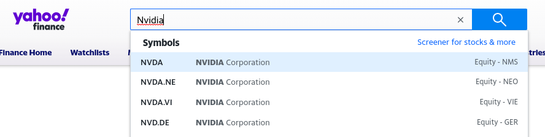

# Street Exchange

Open-source market research powered by Yahoo Finance.

Live Demo: [https://street-exchange.vercel.app/](https://street-exchange.vercel.app/)

## LEGAL DISCLAIMER

The "Street Finance" project is an open-source tool utilizing publicly available APIs from Yahoo. This project is designed solely for research and educational purposes and does not offer financial, investment, or trading advice. Users should be aware that the data and information presented by the project may not always be current or accurate.

All trademarks, including but not limited to Yahoo! and Yahoo! finance, are registered trademarks of Yahoo, Inc. Their use in the "Street Finance" project is strictly for reference, and the project is neither affiliated with nor endorsed by Yahoo, Inc.

Users are advised to exercise caution, conduct independent research, and consult with financial professionals before making any financial decisions based on the project's information. The developers and contributors to the project disclaim any liability for losses or damages resulting from its use.

Users are responsible for complying with relevant laws and regulations

## Getting Started

First, run the development server:

```bash
npm run dev
# or
yarn dev
# or
pnpm dev
```

Open [http://localhost:3000](http://localhost:3000) with your browser and get started with your research on stocks.

## Locating the Stock Symbol (Mandatory for Search)

1. Navigate to the website [finance.yahoo.com](https://finance.yahoo.com/).
2. Utilize the search bar with the autocomplete feature to find your stock.
   
3. Identify the stock symbol, located in the leftmost column of the autocomplete modal. (Ex. **NVDA**)
